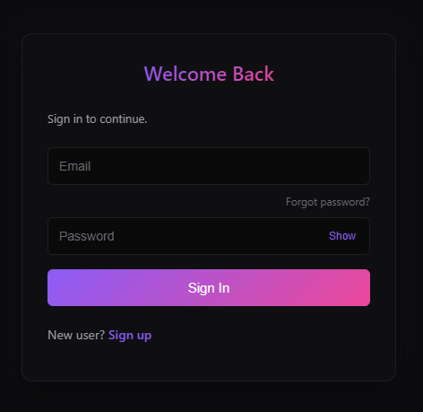
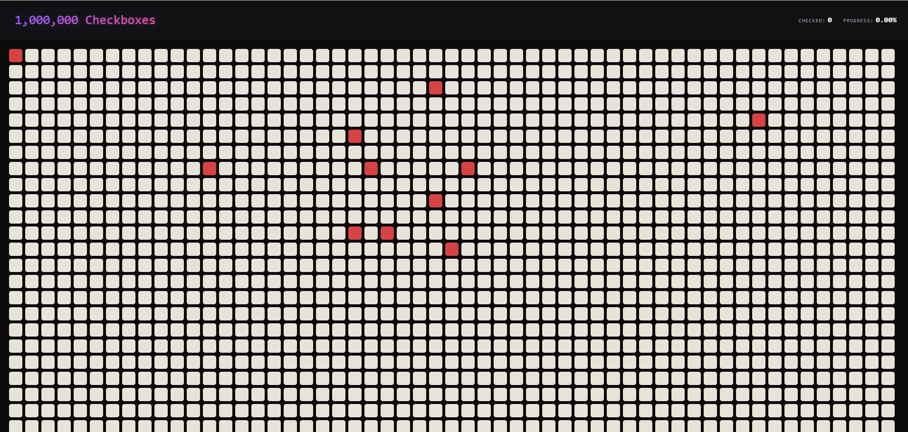

# Million Checkboxes

## Project Overview

Million Checkboxes is a real-time web application that renders one million interactive checkboxes which users can interact with.

The application includes a custom-built OIDC OAuth authentication service. Upon signing in, Multiple users can interact with the system simultaneously, and all updates are synchronized in real time using WebSockets. Redis, running through a Valkey Docker container, is used for shared state management and pub-sub messaging across connected clients. It also notifies who clicked at what time adding more interactivity.

 

## Tech Stack

Frontend
HTML, CSS and Javascript with efficient rendering logic for viewport-based loading

Backend
Node.js with Express

Authentication
Custom OIDC OAuth service

Realtime Communication
WebSockets

State Management
Redis (Valkey Docker container)

Infrastructure
Docker for Redis setup

## Features Implemented

- Efficient rendering of one million checkboxes using viewport-based loading

- Real-time synchronization across users using WebSockets

- Custom OIDC OAuth authentication system

- Centralized state management using Redis

- Pub-sub mechanism for broadcasting updates 

- Rate limiting of one click per five seconds per user

- Live tracker displaying total number of checked boxes

- Real-time activity feed showing user actions with timestamps


## How to Run Locally

Clone the repository

Install dependencies for both services

Navigate to both folders and run:
```bash
npm install
```
Start Redis using Docker:
```bash
docker-compose up
```
Start the OIDC OAuth service:
```bash
cd oidc-oauth
npm run start
```
Start the main application:
```bash
cd million-checkboxes
npm run start
```
Open the application in your browser at the configured port

## Environment Variables Required

For OIDC OAuth service

```bash
PORT
MONGO_URI
CLIENT_SECRET_SALT_ROUNDS
PASSWORD_SALT_ROUNDS
SHORT_CODE_EXPIRY_IN_MINS
VERIFICATION_TOKEN_EXPIRY_in_Hours
REFRESH_TOKEN_EXPIRY_IN_DAYS
ACCESS_TOKEN_EXPIRY_IN_MIN
MAIL_USER - Gmail of auth service provider
MAIL_PASS - App password generated using gmail
```
For main application
```bash
PORT
MONGO_URI
APP_NAME
APPLICATION_URL
REDIRECT_URL
CLIENT_ID
CLIENT_SECRET
```


## Auth Flow Explanation

The application uses a custom OIDC OAuth implementation.

When a user attempts to access the application, they are redirected to the authentication service.

The user logs in using email and password. If new user, user can sign up using name, email and password. A verification link is sent to the new user and upon clicking the same in inbox, user is asked to sign in to access milion checkboxes application.

Upon successful sign in, an authorization code is generated and sent to client on the redirect url provided.

The client exchanges this code for access and refresh tokens using bac channel. And client stores these in database and redirect user to million check boxes page along with the database row id stored in cookie.

The frontend verifies user based on the id stored in cookie.

If valid, user is alllowed to interact with the checkboxes.

## WebSocket Flow Explanation

When a user connects, a WebSocket connection is established with the server. Each user subscribes to updates through Redis pub-sub channels.

When a checkbox is clicked:
- The client sends an event through WebSocket
- The server validates the request
- The state is updated in Redis
- A message is published to all subscribers
- All connected clients receive the update and update their UI in real time

This ensures consistency across all users.

## Rate Limiting Logic Explanation

Each user is restricted to one click every five seconds.
When a click request is received:

The server using package 
```bash
rate-limiter-flexible
```

tracks request volume. It only allows one click every 5 seconds.
An alert message is sent back indicating too many requests.

This prevents spam and ensures fair usage across all users.

---

This project has been the most exciting one i have worked on!
Hope you find it interesting.